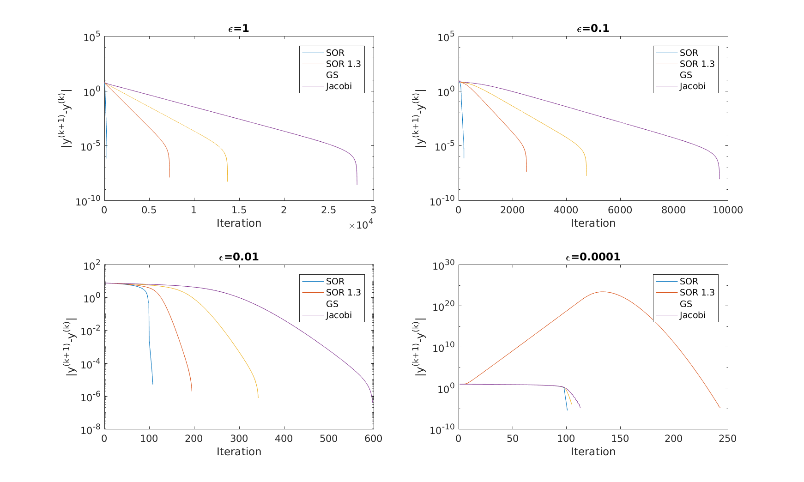

## 数值代数第四章上机作业

_陈子恒 1500010632_

### $\epsilon = 1$ 的情形

代码部分是较为简单的；对于超松弛方法，我们对比了两种不同的情况：一种是用书中公式 $(4.4.13)$ 计算 $\omega_{opt}$ ，另一种是给定值 $1.3$ 。结果见图与表



```
eps:	1.000000e+00
(debug)	SOR: Best omega is 1.9384
SOR	err:    	2.1773e-03	rel_err:	0.0000e+00	step:	282
SOR 1.3	err:	2.1746e-03	rel_err:	5.1532e-06	step:	7258
GS	err:	    2.1731e-03	rel_err:	6.0767e-06	step:	13722
Jacobi	err:	2.1714e-03	rel_err:	7.2729e-06	step:	28155
```
可见四种方法都达到了相似的精度（这里列出的是绝对误差），而最佳松弛的 SOR 步数最少。

#### 相对精度的控制

为了达到四位有效数字，我们先将初始值迭代一步得到 $x_1$ ，认为已经比较靠近真实值 $x^*$ 了，于是停止条件为
$$
\frac{q}{1-q}||x_{k-1}-x_k|| \le 10^{-5}\cdot ||x_1||, q=||M||.
$$

#### 矩阵范数的估计

最先开始是用 `max(abs(eig(M)))` 的办法。后来考虑也许可以用幂法实现，但是由于本问题中 $M$ 通常有复根，在做出一些改进后仍然无法覆盖所有的情况，遂放弃。代码见 `powerMethod.m` 。


### 其他 $\epsilon$ 的情形

观察图（见开头）与表，分别是 $\epsilon = 0.1, 0.01, 0.0001$ 的情形：

```
eps:	1.000000e-01
(debug)	SOR: Best omega is 1.8921
SOR	err:	    3.8374e-02	rel_err:	0.0000e+00	step:	201
SOR 1.3	err:	3.8374e-02	rel_err:	3.3126e-06	step:	2530
GS	err:	    3.8373e-02	rel_err:	2.9175e-06	step:	4753
Jacobi	err:	3.8371e-02	rel_err:	3.3833e-06	step:	9692

eps:	1.000000e-02
(debug)	SOR: Best omega is 1.4985
SOR	err:	    9.8813e-02	rel_err:	0.0000e+00	step:	109
SOR 1.3	err:	9.8815e-02	rel_err:	4.2000e-06	step:	196
GS	err:	    9.8813e-02	rel_err:	3.7554e-06	step:	344
Jacobi	err:	9.8811e-02	rel_err:	3.3084e-06	step:	599

eps:	1.000000e-04
(debug)	SOR: Best omega is 1.0097
SOR	err:	    4.9508e-03	rel_err:	0.0000e+00	step:	102
SOR 1.3	err:	4.9547e-03	rel_err:	3.8988e-06	step:	244
GS	err:	    4.9668e-03	rel_err:	1.6099e-05	step:	106
Jacobi	err:	4.9668e-03	rel_err:	1.6208e-05	step:	114
```

由于在最后一个  case 中 $\epsilon$ 已经很小了，因此几乎不用超松弛，选择太大的 $\omega$ 会使迭代步数增加。

附：感谢岑诗聪同学的提醒，在图中比较的是每两步的误差而不是与精确解的相对误差；这是因为在进行差分离散化时存在数值格式上的误差，导致微分方程的解与差分方程的解存在 $O(\epsilon)$ 的差异。