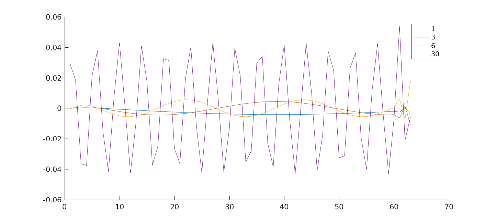

## 数值代数（不知道第几次的）作业

陈子恒 1500010632

### Prob 1

可以看出当 $k$ 很小时，磨光效果非常显著；当 $k$ 与 $N$ 相当时，由于网格太粗，不能显著磨光。

另外，在尾部的数据点变动剧烈，是因为在求解 `(D-L) \ U` 时误差很大造成的。（即便将左除移到 `(D-L) \ (U*u)` 仍然有很大误差）

### Prob 2

并行子空间矫正所用的迭代矩阵 
$$
B_{\rm{psc}}=\sum_{i=1}^J \Pi_i R_i \Pi_i' ,
$$
而逐次子空间矫正所用的迭代矩阵
$$
I - B_{\rm{ssc}}A=\prod_{i=J}^1 (I-T_i), \quad T_i = \Pi_i R_i \Pi_i' A .
$$

当每个子空间上的矫正矩阵是对称正定的、且 $R_i = A_i^{-1}$ ，那么对于由 $B_{\rm{psc}}^{-1}$ 诱导的内积有如下的描述：
$$
(B_{\rm{psc}}^{-1}v,v) = min_{\sum_i \Pi_i v_i=v} \sum_{k=1}^J(R_k^{-1}v_k, v_k) .
$$
类似的，对于由 $\bar{B}_{\rm{ssc}}^{-1}$ 诱导的内积可以描述为
$$
(\bar{B}_{\rm{ssc}}^{-1}v,v) = inf_{\sum_i \Pi_i v_i=v} \sum_{k=1}^J \left\lVert P_i \sum_{j=i+1}^J \Pi_j v_j \right\rVert^2_{A_i} .
$$
在做出上述准备后，我们开始估计 $v$ 的模。

---

一方面， $||v||_A^2 = -\sum_{k=1}^J (v_k, v_k)_A + 2\sum^J_{j \geq k}(v_k, v_j)_A$ ，因此
$$
\begin{align}
\sum_{k=1}^J ||v_k||_A^2
&\leq 2\sum_{k=1}^J \left( v_k, \sum_{j=k}^J  v_j\right)_A \\
&=^{[1]} 2\sum_{k=1}^J \left( v_k, P_k \sum_{j=k}^J  v_j\right)_A \\
&\leq^{[2]} 2\left(\sum_{k=1}^J \left\lVert P_k \sum_{j=k}^J  v_j \right\rVert^2_A \right)^{1/2} \left(\sum_{k=1}^J \left\lVert v_k \right\rVert^2_A \right)^{1/2} \\
\end{align}
$$

这里

1. $\sum_{j=k}^J  v_j$ 与 $v_k$ 做内积，因此只需要考虑投影在 $V_k$ 上做内积即可。
2. Cauchy-Schwarz 不等式。

整理得
$$
\sum_{k=1}^J ||v_k||_A^2 \leq 4 \sum_{k=1}^J \left\lVert P_k \sum_{j=k}^J  v_j \right\rVert^2_A ,
$$
于是
$$
(B_{\rm{psc}}^{-1}v,v) \leq 4 \sum_{k=1}^J \left\lVert P_k \sum_{j=k}^J  v_j \right\rVert^2_A = 4 (\bar{B}_{\rm{ssc}}^{-1}v,v).
$$

---

上界通过以下不等式建立：
$$
\begin{align}
\sum_{k=1}^J \left\lVert P_k \sum_{j=k}^J  v_j \right\rVert^2_A
&=^{[1]} \sum_{k=1}^J \left\lVert P_k \sum_{j \in N(k); j \geq k}  v_j \right\rVert^2_A \\
&\leq^{[2]} \sum_{k=1}^J \left\lVert \sum_{j \in N(k); j \geq k}  v_j \right\rVert^2_A \\
&\leq^{[3]} \sum_{k=1}^J N(k) \sum_{j \in N(k); j \geq k} ||v_j||^2_A \\
&\leq \sqrt{c} \sum_{k=1}^J \sum_{j \in N(k); j \geq k} ||v_j||^2_A \\
&\leq \sqrt{c} \sum_{k=1}^J \sum_{j \in N(k)} ||v_j||^2_A \\
&\leq c \sum_{k=1}^J ||v_k||^2_A \\
\end{align}
$$

这里：

1. 对于 $j \notin N(k)$ ， $P_k v_j = 0$ 。
2. $||P_k v_j||^2_A \leq ||v_j||^2_A$ 。
3. $||\sum_{i=1}^K w_i||^2 \leq K \sum_{i=1}^K ||v_i||^2$ 。

于是
$$
(\bar{B}_{\rm{ssc}}^{-1}v,v) \leq c (B_{\rm{psc}}^{-1}v,v).
$$

### Prob 3

注意到
$$
||(I-T)v||^2_A = ((I-\bar{T})v, v)_A, \quad \forall v \in V.
$$
于是可以得到对于 $E$ 的描述：
$$
\begin{align}
||E||^2_A 
&= max_{w\in W}\frac{||(I-T)(I-\Pi_C)w||^2_A}{||w||^2_A} \\
&= max_{w\in W}\frac{((I-\bar{T})(I-\Pi_C)w, (I-\Pi_C)w)_A}{||w||^2_A} \\
&= 1 - min_{w\in W}\frac{(\bar{T}(I-\Pi_C)w, (I-\Pi_C)w)_A}{||w||^2_A} \\
&= 1 - min_{w\in W}\frac{(Q_1\bar{T}(I-\Pi_C)w, (I-\Pi_C)w)_A}{||(I-\Pi_C)w||^2_A + ||\Pi_C w||^2_A} \\
&= 1 - min_{v\in W_C^{\perp_A}}\frac{(Q_1\bar{T}v, v)_A}{||v||^2_A} \\
&= 1 - min_{v\in W_C^{\perp_A}}\frac{((I-\Pi_C)Q_1\bar{T}v, v)_A}{||v||^2_A} \\
&= 1- \lambda_{min}(X)
\end{align}
$$
这里 $X=(I-\Pi_C)Q_1\bar{T}$ 是 $W_C^{\perp_A}$ 上的变换，在 $(\cdot, \cdot)_A$ 的意义下是自伴的。

注意到 $X$ 的逆可以被显式地写为
$$
Z = (Q_1 \bar{T})^{-1}(I-Q_C),
$$
（这是因为 $(\Pi_CZu,v)_A = ((Q_1 \bar{T})^{-1}(I-Q_C)u, \Pi_Cv)_A = (\bar{T}(Q_1 \bar{T})^{-1}(I-Q_C)u, \Pi_Cv)_{\bar{R}^{-1}} $ $= (Q_1\bar{T}(Q_1 \bar{T})^{-1}(I-Q_C)u, \Pi_Cv)_{\bar{R}^{-1}} =((I-Q_C)u, \Pi_Cv)_{\bar{R}^{-1}} = 0$ ，意味着 $\Pi_C Z = 0$ ）。

由于 $Z$ 也是$W_C^{\perp_A}$ 上的变换，并且 $XZ=I$ ，于是可以得到 $Z$ 特征值的信息：
$$
\begin{align}
\lambda_{max}(Z)
&= max_{v\in W_C^{\perp_A}} \frac{((Q_1\bar{T})^{-1}(I-Q_C)v, v)_A}{(v, v)_A} \\
&= max_{v\in W_C^{\perp_A}} \frac{(\bar{T}(Q_1\bar{T})^{-1}(I-Q_C)v, v)_{\bar{R}^{-1}}}{(v, v)_A} \\
&= max_{v\in W_C^{\perp_A}} \frac{(Q_1\bar{T}(Q_1\bar{T})^{-1}(I-Q_C)v, v)_{\bar{R}^{-1}}}{(v, v)_A} \\
&= max_{v\in W_C^{\perp_A}} \frac{((I-Q_C)v, v)_{\bar{R}^{-1}}}{(v, v)_A} \\
&= max_{v\in W_C^{\perp_A}} \frac{||(I-Q_C)v||^2_{\bar{R}^{-1}}}{(v, v)_A} \\
&= K(V_C).
\end{align}
$$

这里 $K(V_C) = max_{v \in W} min_{v_C \in W_C} \frac{||v-v_C||^2_{\bar{R}^{-1}}}{||v||^2_A}$ ，距离要证明的 $K(P) = max_{v} min_{v_C} \frac{||v-Pv_C||^2_{\bar{R}^{-1}}}{||v||^2_A}$ 其实无几。因为固定 $P v_C$ 后，$v$ 不在 $W$ 上的分量只能增加 $||v_A||^2_A$ ，因此可以假设 $v \in W$ 。对于 $v_C$ 可有类似讨论。