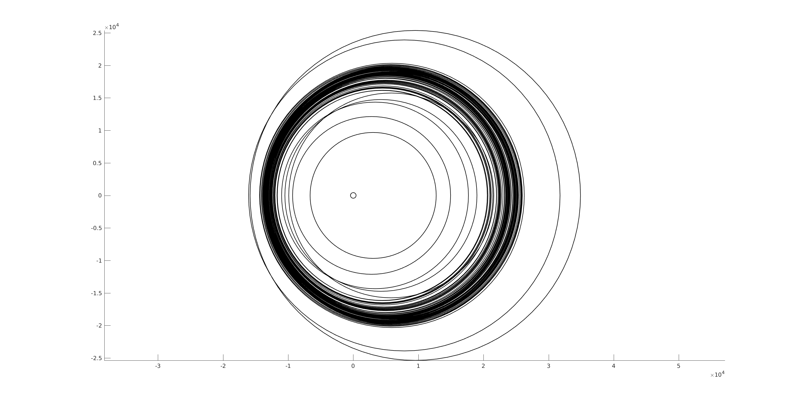

# 数值代数大作业

__陈子恒 1500010632__

## 第一题

### 第一问

注意到 $\mathbb{A}_h$ 是分块三对角的结构，于是可以大幅简化其 Cholesky 分解的复杂度，即
$$
\mathbb{A}_h = \mathbb{L}_h \mathbb{L}^T_h,
$$

这里
$$
\mathbb{L}_h = \begin{pmatrix} L_1 & & & & \\K_1 & L_2 & & \\ & K_2 &\ddots & \\ &&\ddots&\ddots&\\&&&K_{N-1}&L_{N-1}\end{pmatrix} \\
\textbf{where} \quad K_iL_i = -I_{N-1}/h_x^2 \quad (i = 1, \dots , N-1) \\
L_1 L_1^T = K_1 K_1^T+L_2 L_2^T = \cdots=a_{N-1,h}.
$$
在得到 Cholesky 分解后我们用块追赶法求解原问题，这里不再赘述代码实现，见 `prob1/prob1_1.m` ；数值结果如下：

|  eps |  error   | time |
| ---: | :------: | :--- |
| 1e-0 | 7.79e-15 | 0.37 |
| 1e-3 | 3.18e-15 | 0.32 |
| 1e-5 | 1.09e-14 | 0.30 |

```plain
Error is 7.7895e-15 (eps=1.0e+00).
Error is 3.1768e-15 (eps=1.e-3).
Error is 1.0885e-14 (eps=1.e-5).
```

### 第二问与第三问

我们在 `prob1/PCG.m` 中实现了预优共轭梯度法的框架，在 `prob1/VCycle.m` 中实现了 V-字形多重网格的框架。这里我们着重讨论两点。

#### 光滑子的表述与实现

我们一共有三种光滑子可以选取：对 x 方向进行的对称线 GS 迭代，对 y 方向进行的对称线 GS 迭代，对称点 GS 迭代。

对称点 GS 迭代是最简单的：将 $Ax=b$ 中的矩阵 $A$ 分解为
$$
A = D-L-U,
$$
那么普通的 GS 迭代格式为
$$
x^* = \left( (D-L)^{-1}U\right) x + (D-L)^{-1}b,
$$
其中迭代矩阵 $(D-L)^{-1}U$ 不是对称的，很那分析收敛性。于是我们可以使用对称化的技巧：

$$
x^{**} = \left( (D-U)^{-1}L\right) x^* + (D-U)^{-1}b.
$$
为了说明这点，我们令 $B = (D-L)^{-1}$ ，那么
$$
\begin{align}
(D-L)^{-1}U(D-U)^{-1}L &= (I-BA)(I-B^TA) \\
&=I-(B+B^T-BAB^T)A,
\end{align}
$$

那么 $B+B^T-BAB^T$ 确实是对称矩阵。

---

对称线算法与对称点非常类似，唯一不同之处在于 $A$ 的分解变成以 $(N-1)\times(N-1)$ 块为单位的。考虑到 $\mathbb{U}_h$ 的元素排列方式，直接进行按块分解是对 x 方向做 GS 迭代；那么在对 y 方向上做迭代时就需要对元素进行重排。

先构造排列矩阵 $P \in \mathbb{R}^{(N-1)^2\times(N-1)^2}$ ，使得 $P$ 能够将一个 $\mathbb{R}^{(N-1)^2}$ 向量的第 $(N-1)i+j$ 个元素与第 $(N-1)j+i$ 个元素交换，那么原问题化为
$$
(PAP) (Px) = Pb.
$$

#### 粗网格上的矩阵的获得

假设我们已经知道了细网格上的矩阵 $\mathbb{A}_h$ ，我们希望将其提升到粗网格上；根据多重网格理论，表达式为
$$
\mathbb{A}_{2h} = I^{2h}_h \mathbb{A}_h I^h_{2h},
$$
这里 $I_h^{2h}$ 是限制算子，而 $I^h_{2h}$ 是提升算子，它们的表达式为：
$$
I_h^{2h} = R_h^{2h} \otimes R_h^{2h}, I^h_{2h} = L^h_{2h} \otimes L^h_{2h}
$$
$\otimes$ 为 Kronecker 积，而 $R_h^{2h}$ 与 $L^h_{2h}$ 为一维情形的限制与提升算子。

我们试用归纳法证明， $\mathbb{A}_h$ 是分块三对角矩阵，主对角线上块为 $\mathbb{M}_h$ ，次对角线上块为 $\mathbb{Q}_h$ ，并且 $\mathbb{M}_h,\mathbb{Q}_h$ 都是三对角的。

容易证明在最细的网格上上述命题成立。那么，直接计算矩阵向上提升一个网格后的变化：
$$
\begin{align}
\mathbb{A}_{2h} &= I^{2h}_h \mathbb{A}_h I^h_{2h} \\
&=\left(R_h^{2h} \otimes R_h^{2h}\right)\left(V \otimes \frac{1}{2}\left(M+Q\right)\right) \left(L^h_{2h} \otimes L^h_{2h}\right) + \left(R_h^{2h} \otimes R_h^{2h}\right)\left(W \otimes \frac{1}{2}\left(M-Q\right)\right) \left(L^h_{2h} \otimes L^h_{2h}\right) \\
&=\frac{1}{2}\left(R_h^{2h} V L^h_{2h}\right) \otimes \left(R_h^{2h} \left(M+Q\right) L^h_{2h}\right) + \frac{1}{2}\left(R_h^{2h} W L^h_{2h}\right) \otimes \left(R_h^{2h} \left(M-Q\right) L^h_{2h}\right) \\
\end{align}
$$
这里 $V$ 是主对角线为 $1$ ，次对角线也为 $1$ 的三对角矩阵；而 $W$ 是主对角线为 $1$ ，次对角线为 $-1$ 的三对角矩阵。直接计算知道 $R_h^{2h} V L^h_{2h}$ 是主对角线为 $\frac{7}{4}$ ，次对角线为 $\frac{5}{8}$ 的三对角矩阵，而 $R_h^{2h} W L^h_{2h}$ 是主对角线为 $-\frac{1}{4}$ ，次对角线为 $-\frac{3}{8}$ 的三对角矩阵。类似地，因为 $(M\pm Q)$ 是三对角矩阵，所以 $R_h^{2h} \left(M\pm Q\right) L^h_{2h}$ 是三对角矩阵。这一点极大地简化了计算量，见 `prob1/VCycle.m(57-61)` 。

#### 数值结果

在上述讨论之后，我们对不同的网格大小与 $\epsilon$ 进行了数值实验，结果如下：（作图文件见 `prob1/resultHelper.m`）

__N=32__
<table><tr><th></th><th colspan="3">eps=1e+1</th><th colspan="3">eps=1e0</th><th colspan="3">eps=1e-1</th></tr><tr><td></td><td>time</td><td>iteration</td><td>error</td><td>time</td><td>iteration</td><td>error</td><td>time</td><td>iteration</td><td>error</td></tr><tr><td>symlinex</td><td>0.04</td><td>15</td><td>1.9e-7</td><td>0.05</td><td>15</td><td>1.9e-7</td><td>0.04</td><td>15</td><td>1.9e-7</td></tr><tr><td>symliney</td><td>0.01</td><td>1</td><td>1.9e-14</td><td>0.01</td><td>1</td><td>1.9e-14</td><td>0.00</td><td>1</td><td>1.9e-14</td></tr><tr><td>sympoint</td><td>0.04</td><td>17</td><td>1.3e-6</td><td>0.03</td><td>17</td><td>1.3e-6</td><td>0.02</td><td>17</td><td>1.3e-6</td></tr><tr><td>id</td><td>0.00</td><td>16</td><td>1.9e-14</td><td>0.00</td><td>16</td><td>1.9e-14</td><td>0.00</td><td>16</td><td>1.9e-14</td></tr><tr><td></td><td colspan="3">eps=1e-3</td><td colspan="3">eps=1e-5</td><td colspan="3">eps=1e-7</td></tr><tr><td></td><td>time</td><td>iteration</td><td>error</td><td>time</td><td>iteration</td><td>error</td><td>time</td><td>iteration</td><td>error</td></tr><tr><td>symlinex</td><td>0.04</td><td>15</td><td>1.9e-7</td><td>0.04</td><td>15</td><td>1.9e-7</td><td>0.04</td><td>15</td><td>1.9e-7</td></tr><tr><td>symliney</td><td>0.01</td><td>1</td><td>1.9e-14</td><td>0.01</td><td>1</td><td>1.9e-14</td><td>0.01</td><td>1</td><td>1.9e-14</td></tr><tr><td>sympoint</td><td>0.02</td><td>17</td><td>1.3e-6</td><td>0.03</td><td>17</td><td>1.3e-6</td><td>0.03</td><td>17</td><td>1.3e-6</td></tr><tr><td>id</td><td>0.00</td><td>16</td><td>1.9e-14</td><td>0.00</td><td>16</td><td>1.9e-14</td><td>0.00</td><td>16</td><td>1.9e-14</td></tr></table>


__N=64__
<table><tr><th></th><th colspan="3">eps=1e+1</th><th colspan="3">eps=1e0</th><th colspan="3">eps=1e-1</th></tr><tr><td></td><td>time</td><td>iteration</td><td>error</td><td>time</td><td>iteration</td><td>error</td><td>time</td><td>iteration</td><td>error</td></tr><tr><td>symlinex</td><td>0.18</td><td>25</td><td>2.2e-6</td><td>0.23</td><td>25</td><td>2.2e-6</td><td>0.16</td><td>25</td><td>2.2e-6</td></tr><tr><td>symliney</td><td>0.01</td><td>1</td><td>1.2e-13</td><td>0.01</td><td>1</td><td>1.2e-13</td><td>0.01</td><td>1</td><td>1.2e-13</td></tr><tr><td>sympoint</td><td>0.12</td><td>32</td><td>3.2e-6</td><td>0.12</td><td>32</td><td>3.2e-6</td><td>0.12</td><td>32</td><td>3.2e-6</td></tr><tr><td>id</td><td>0.01</td><td>32</td><td>5.0e-6</td><td>0.01</td><td>32</td><td>5.0e-6</td><td>0.00</td><td>32</td><td>5.0e-6</td></tr><tr><td></td><td colspan="3">eps=1e-3</td><td colspan="3">eps=1e-5</td><td colspan="3">eps=1e-7</td></tr><tr><td></td><td>time</td><td>iteration</td><td>error</td><td>time</td><td>iteration</td><td>error</td><td>time</td><td>iteration</td><td>error</td></tr><tr><td>symlinex</td><td>0.16</td><td>25</td><td>2.2e-6</td><td>0.2</td><td>25</td><td>2.2e-6</td><td>0.16</td><td>25</td><td>2.2e-6</td></tr><tr><td>symliney</td><td>0.01</td><td>1</td><td>1.2e-13</td><td>0.01</td><td>1</td><td>1.2e-13</td><td>0.01</td><td>1</td><td>1.2e-13</td></tr><tr><td>sympoint</td><td>0.12</td><td>32</td><td>3.2e-6</td><td>0.12</td><td>32</td><td>3.2e-6</td><td>0.12</td><td>32</td><td>3.2e-6</td></tr><tr><td>id</td><td>0.01</td><td>32</td><td>5.0e-6</td><td>0.01</td><td>32</td><td>5.0e-6</td><td>0.01</td><td>32</td><td>5.0e-6</td></tr></table>


__N=128__
<table><tr><th></th><th colspan="3">eps=1e+1</th><th colspan="3">eps=1e0</th><th colspan="3">eps=1e-1</th></tr><tr><td></td><td>time</td><td>iteration</td><td>error</td><td>time</td><td>iteration</td><td>error</td><td>time</td><td>iteration</td><td>error</td></tr><tr><td>symlinex</td><td>0.73</td><td>38</td><td>4.9e-6</td><td>0.69</td><td>38</td><td>4.9e-6</td><td>0.73</td><td>38</td><td>4.9e-6</td></tr><tr><td>symliney</td><td>0.02</td><td>1</td><td>4.9e-13</td><td>0.02</td><td>1</td><td>4.9e-13</td><td>0.02</td><td>1</td><td>4.9e-13</td></tr><tr><td>sympoint</td><td>0.72</td><td>60</td><td>1.3e-5</td><td>0.76</td><td>60</td><td>1.3e-5</td><td>0.75</td><td>60</td><td>1.3e-5</td></tr><tr><td>id</td><td>0.09</td><td>64</td><td>1.4e-5</td><td>0.03</td><td>64</td><td>1.4e-5</td><td>0.03</td><td>64</td><td>1.4e-5</td></tr><tr><td></td><td colspan="3">eps=1e-3</td><td colspan="3">eps=1e-5</td><td colspan="3">eps=1e-7</td></tr><tr><td></td><td>time</td><td>iteration</td><td>error</td><td>time</td><td>iteration</td><td>error</td><td>time</td><td>iteration</td><td>error</td></tr><tr><td>symlinex</td><td>0.69</td><td>38</td><td>4.9e-6</td><td>0.73</td><td>38</td><td>4.9e-6</td><td>0.69</td><td>38</td><td>4.9e-6</td></tr><tr><td>symliney</td><td>0.02</td><td>1</td><td>4.9e-13</td><td>0.02</td><td>1</td><td>4.9e-13</td><td>0.02</td><td>1</td><td>4.9e-13</td></tr><tr><td>sympoint</td><td>0.76</td><td>60</td><td>1.3e-5</td><td>0.76</td><td>60</td><td>1.3e-5</td><td>0.77</td><td>60</td><td>1.3e-5</td></tr><tr><td>id</td><td>0.03</td><td>64</td><td>1.4e-5</td><td>0.03</td><td>64</td><td>1.4e-5</td><td>0.03</td><td>64</td><td>1.4e-5</td></tr></table>


__N=256__
<table><tr><th></th><th colspan="3">eps=1e+1</th><th colspan="3">eps=1e0</th><th colspan="3">eps=1e-1</th></tr><tr><td></td><td>time</td><td>iteration</td><td>error</td><td>time</td><td>iteration</td><td>error</td><td>time</td><td>iteration</td><td>error</td></tr><tr><td>symlinex</td><td>4.05</td><td>66</td><td>9.4e-6</td><td>4.03</td><td>66</td><td>9.4e-6</td><td>4.15</td><td>66</td><td>9.4e-6</td></tr><tr><td>symliney</td><td>0.07</td><td>1</td><td>2.0e-12</td><td>0.07</td><td>1</td><td>2.0e-12</td><td>0.07</td><td>1</td><td>2.0e-12</td></tr><tr><td>sympoint</td><td>5.17</td><td>105</td><td>3.5e-5</td><td>5.41</td><td>105</td><td>3.5e-5</td><td>5.39</td><td>105</td><td>3.5e-5</td></tr><tr><td>id</td><td>0.38</td><td>128</td><td>4.1e-5</td><td>0.38</td><td>128</td><td>4.1e-5</td><td>0.44</td><td>128</td><td>4.1e-5</td></tr><tr><td></td><td colspan="3">eps=1e-3</td><td colspan="3">eps=1e-5</td><td colspan="3">eps=1e-7</td></tr><tr><td></td><td>time</td><td>iteration</td><td>error</td><td>time</td><td>iteration</td><td>error</td><td>time</td><td>iteration</td><td>error</td></tr><tr><td>symlinex</td><td>3.99</td><td>66</td><td>9.4e-6</td><td>3.99</td><td>66</td><td>9.4e-6</td><td>4.01</td><td>66</td><td>9.4e-6</td></tr><tr><td>symliney</td><td>0.07</td><td>1</td><td>2.0e-12</td><td>0.07</td><td>1</td><td>2.0e-12</td><td>0.07</td><td>1</td><td>2.0e-12</td></tr><tr><td>sympoint</td><td>5.21</td><td>105</td><td>3.5e-5</td><td>5.21</td><td>105</td><td>3.5e-5</td><td>5.23</td><td>105</td><td>3.5e-5</td></tr><tr><td>id</td><td>0.25</td><td>128</td><td>4.1e-5</td><td>0.29</td><td>128</td><td>4.1e-5</td><td>0.28</td><td>128</td><td>4.1e-5</td></tr></table>


__N=512__
<table><tr><th></th><th colspan="3">eps=1e+1</th><th colspan="3">eps=1e0</th><th colspan="3">eps=1e-1</th></tr><tr><td></td><td>time</td><td>iteration</td><td>error</td><td>time</td><td>iteration</td><td>error</td><td>time</td><td>iteration</td><td>error</td></tr><tr><td>symlinex</td><td>31.1</td><td>125</td><td>2.7e-5</td><td>35.73</td><td>125</td><td>2.7e-5</td><td>30.05</td><td>125</td><td>2.7e-5</td></tr><tr><td>symliney</td><td>0.33</td><td>1</td><td>7.8e-12</td><td>0.32</td><td>1</td><td>7.8e-12</td><td>0.26</td><td>1</td><td>7.8e-12</td></tr><tr><td>sympoint</td><td>53.26</td><td>191</td><td>8.8e-5</td><td>47.16</td><td>191</td><td>8.8e-5</td><td>42.95</td><td>191</td><td>8.8e-5</td></tr><tr><td>id</td><td>4.35</td><td>257</td><td>1.2e-4</td><td>2.7</td><td>257</td><td>1.2e-4</td><td>3.01</td><td>257</td><td>1.2e-4</td></tr><tr><td></td><td colspan="3">eps=1e-3</td><td colspan="3">eps=1e-5</td><td colspan="3">eps=1e-7</td></tr><tr><td></td><td>time</td><td>iteration</td><td>error</td><td>time</td><td>iteration</td><td>error</td><td>time</td><td>iteration</td><td>error</td></tr><tr><td>symlinex</td><td>30.25</td><td>125</td><td>2.7e-5</td><td>28.42</td><td>125</td><td>2.7e-5</td><td>29.74</td><td>125</td><td>2.7e-5</td></tr><tr><td>symliney</td><td>0.29</td><td>1</td><td>7.8e-12</td><td>0.25</td><td>1</td><td>7.8e-12</td><td>0.27</td><td>1</td><td>7.8e-12</td></tr><tr><td>sympoint</td><td>42.81</td><td>191</td><td>8.8e-5</td><td>41.4</td><td>191</td><td>8.8e-5</td><td>43.35</td><td>191</td><td>8.8e-5</td></tr><tr><td>id</td><td>2.67</td><td>257</td><td>1.2e-4</td><td>3.02</td><td>257</td><td>1.2e-4</td><td>2.54</td><td>257</td><td>1.2e-4</td></tr></table>


__N=1024__
<table><tr><th></th><th colspan="3">eps=1e+1</th><th colspan="3">eps=1e0</th><th colspan="3">eps=1e-1</th></tr><tr><td></td><td>time</td><td>iteration</td><td>error</td><td>time</td><td>iteration</td><td>error</td><td>time</td><td>iteration</td><td>error</td></tr><tr><td>symlinex</td><td>65.39</td><td>64</td><td>2.4e-2</td><td>62.77</td><td>64</td><td>2.4e-2</td><td>62.08</td><td>64</td><td>2.4e-2</td></tr><tr><td>symliney</td><td>1.17</td><td>1</td><td>1.6e-10</td><td>1.21</td><td>1</td><td>1.6e-10</td><td>1.13</td><td>1</td><td>1.6e-10</td></tr><tr><td>sympoint</td><td>64.82</td><td>64</td><td>2.4e-2</td><td>64.81</td><td>64</td><td>2.4e-2</td><td>61.57</td><td>64</td><td>2.4e-2</td></tr><tr><td>id</td><td>63.18</td><td>1024</td><td>2.7e-6</td><td>70.7</td><td>1024</td><td>2.7e-6</td><td>69.2</td><td>1024</td><td>2.7e-6</td></tr><tr><td></td><td colspan="3">eps=1e-3</td><td colspan="3">eps=1e-5</td><td colspan="3">eps=1e-7</td></tr><tr><td></td><td>time</td><td>iteration</td><td>error</td><td>time</td><td>iteration</td><td>error</td><td>time</td><td>iteration</td><td>error</td></tr><tr><td>symlinex</td><td>60.46</td><td>64</td><td>2.4e-2</td><td>62.82</td><td>64</td><td>2.4e-2</td><td>62.84</td><td>64</td><td>2.4e-2</td></tr><tr><td>symliney</td><td>1.14</td><td>1</td><td>1.6e-10</td><td>1.13</td><td>1</td><td>1.6e-10</td><td>1.13</td><td>1</td><td>1.6e-10</td></tr><tr><td>sympoint</td><td>64.15</td><td>64</td><td>2.4e-2</td><td>67.38</td><td>64</td><td>2.4e-2</td><td>62.03</td><td>64</td><td>2.4e-2</td></tr><tr><td>id</td><td>66.89</td><td>1024</td><td>2.7e-6</td><td>63.41</td><td>1024</td><td>2.7e-6</td><td>63.42</td><td>1024</td><td>2.7e-6</td></tr></table>


可见，对 y 方向做线 GS 迭代速度是非常快的，只需要一步就能收敛；作为对比，图表中 id 项是没有预矫正的共轭梯度法，虽然每一步迭代速度很快，但是次数随着问题的规模而增长；值得注意的是，达到收敛条件恰需要 $\frac{N}{2}$ 步。


固定 $\epsilon=10^{-5}$ ，考察误差与问题规模的关系：我们暂时去掉了 $N=1024$ 的情况（因为有两个算法需要很长时间才能收敛），从上图大致可以看出，随着 $N$ 指数增大，误差也呈指数增长。


## 第二题

### 算法实现

参考材料上的算法步骤有误，本文测试用的代码是根据 __[GHG00]__ 实现的：
$$
\begin{align}
& \textbf{Algorithm 1:} \quad \text{Inverse Free Krylov Subspace Method.} \\
& \textbf{Input:} \quad m \ge 1, U_0 \in \mathbb{R}^{\mathbb{N}\times \mathbb{N}}\\
& \rho_0 = \rho(U_0) \\
& \textbf{for} \quad k = 0, 1, 2 \dots \\
& \qquad Z_m=[z_0,z_1,\dots,z_m] \quad \text{(basis for} \quad \mathcal{K}_m(U_k,\mathbb{A}_h-\rho_k\mathbb{M}_h) \text{)} \\
& \qquad A = Z_m^T(\mathbb{A}_h-\rho_k\mathbb{M}_h)Z_m \\
& \qquad M = Z^T_m \mathbb{M}_hZ_m \\
& \qquad [\mu, \nu] = \text{smallest_eigen_pair}(A, M) \\
& \qquad \rho_{k+1} = \rho_k + \mu \\
& \qquad U_{k+1} = Z_m \nu
\end{align}
$$
其中求 Krylov 子空间基的步骤与最小特征对的算法如下：
$$
\begin{align}
&\textbf{Algorithm 2:}  \quad \mathbb{M}_h\text{-orthonormal basis by Arnoldi.} \\
&\textbf{Input:} \quad C_k = \mathbb{A}_h-\rho_k\mathbb{M}_h, U_k \\
&\textbf{Output:} \quad Z_m = [z_0, z_1, \dots, z_m] \\
& z_0 = U_k / ||U_k||_{\mathbb{M}_h} \\
&\textbf{for} \quad i=0:(m-1) \\
&\qquad w = C_k z_i \\
&\qquad w = w - [z_0, z_1, \dots z_i] \cdot [z_0, z_1, \dots z_i]^T \mathbb{M}_h w \\
&\qquad z_{i+1} = w / ||w||_{\mathbb{M}_h}
\end{align}
$$

$$
\begin{align}
&\textbf{Algorithm 3:}  \quad \text{Smallest eigenpair using Rayleigh quotient.} \\
&\textbf{Input:} \quad A, M \approx I\\
&\textbf{Output:} \quad \mu, \nu \\
&\mu_0 = \text{max}\{-\textbf{1}^TA\} \\
&x = \text{rand vector} \\
&\textbf{for} \quad i = 1:5 \\
&\qquad x = (A-\mu_0I)^{-1} x \\
&\mu_1 = \frac{x^TAx}{x^Tx} \\
&\nu = (A-\mu_1I)^{-1} x \\
&\mu = \frac{\nu^TA\nu}{\nu^T\nu}
\end{align}
$$

#### 最小特征对算法

根据 __Algorithm 1__ 的描述，每一次我们找的是在 $\mathbb{M}_h$ 内积意义下单位正交的基 $Z_m$ ，因此，在代入求最小特征根时 $M$ 应该非常接近单位阵。为了避免不必要的误差，我们处理输入时假定 $M=I$ 。

注意到原问题求的是 $\mathbb{A}_h x = \lambda \mathbb{M}_h x$ 的最小特征值，所以每一步我们求的是带符号的最小特征值（对应 `eigs(A, M, 1, 'sa')` ），而非最靠近 $0$ 的特征值（对应 `eigs(Ah, Mh, 1, 'sm')` ）；这要求我们给出特征值下界的一个良好的估计。一种办法是取 1-范数或 $\infty$-范数，但是这往往比真实值大出三个数量级，没有什么使用价值。

考虑 Gersgorin 圆盘定理，尽管最大的圆盘会盖住剩下的圆盘，但我们可以不妨假设每个特征值恰位于某一个圆盘中，因此左端点位于最右边的圆盘就能够给出最小特征值的一个估计。在这之后我们先使用几步反幂法，再使用 Rayleigh 商的反幂法就能很容易地求得比较准的特征值。



### MATLAB 内置 `eigs` 运行结果

取定 $\epsilon=10^{-1}$ ，使用 `eigs(Ah, Mh, 1, 'sa')` 求解特征值，用 $N=32,\dots 96$ 的问题规模估算在原问题的规模会花费的时间：（测试代码见 `prob2/prob2_eigs.m` ）

|    N | time(s) |
| ---: | :-----: |
|   32 |  0.12   |
|   64 |  1.52   |
|  128 |  19.62  |
|  256 | 253.53  |
|  512 | 3276.8  |
| 1024 |  42351  |

### 数值结果

注：下表中误差是与最小特征向量 $sin(\pi x)sin(\pi y)$ 的离散格式，在 $\mathbb{M}_h$ 内积意义下归一化后进行比较的。

__N=32__
<table><tr><th></th><th colspan="3">eps=1e0</th><th colspan="3">eps=1e-1</th><th colspan="3">eps=1e-3</th><th colspan="3">eps=1e-5</th><th colspan="3">eps=1e-7</th></tr><tr><td></td><td>time</td><td>itr</td><td>err</td><td>time</td><td>itr</td><td>err</td><td>time</td><td>itr</td><td>err</td><td>time</td><td>itr</td><td>err</td><td>time</td><td>itr</td><td>err</td></tr><tr><td>l=5</td><td>0.0</td><td>29</td><td>2.6e-3</td><td>0.1</td><td>115</td><td>2.6e-3</td><td>2.3</td><td>2529</td><td>2.6e-3</td><td>3.3</td><td>3779</td><td>2.6e-3</td><td>3.3</td><td>3797</td><td>2.6e-3</td></tr><tr><td>l=10</td><td>0.0</td><td>9</td><td>2.6e-3</td><td>0.0</td><td>33</td><td>2.6e-3</td><td>0.7</td><td>472</td><td>2.6e-3</td><td>1.1</td><td>878</td><td>2.6e-3</td><td>1.2</td><td>957</td><td>2.6e-3</td></tr><tr><td>l=20</td><td>0.0</td><td>5</td><td>2.6e-3</td><td>0.1</td><td>12</td><td>2.6e-3</td><td>0.3</td><td>143</td><td>2.6e-3</td><td>0.4</td><td>190</td><td>2.6e-3</td><td>0.6</td><td>243</td><td>2.6e-3</td></tr><tr><td>l=40</td><td>0.0</td><td>5</td><td>4.4e-2</td><td>0.0</td><td>4</td><td>2.6e-3</td><td>0.1</td><td>30</td><td>2.6e-3</td><td>0.3</td><td>50</td><td>2.6e-3</td><td>0.3</td><td>52</td><td>2.6e-3</td></tr><tr><td>l=80</td><td>0.1</td><td>3</td><td>2.6e-3</td><td>0.0</td><td>3</td><td>2.6e-3</td><td>0.2</td><td>18</td><td>2.6e-3</td><td>0.4</td><td>24</td><td>2.6e-3</td><td>0.3</td><td>20</td><td>2.6e-3</td></tr></table>


__N=64__
<table><tr><th></th><th colspan="3">eps=1e0</th><th colspan="3">eps=1e-1</th><th colspan="3">eps=1e-3</th><th colspan="3">eps=1e-5</th><th colspan="3">eps=1e-7</th></tr><tr><td></td><td>time</td><td>itr</td><td>err</td><td>time</td><td>itr</td><td>err</td><td>time</td><td>itr</td><td>err</td><td>time</td><td>itr</td><td>err</td><td>time</td><td>itr</td><td>err</td></tr><tr><td>l=5</td><td>0.3</td><td>99</td><td>6.5e-4</td><td>1.1</td><td>419</td><td>6.6e-4</td><td>39.7</td><td>14781</td><td>6.7e-4</td><td>100.8</td><td>38043</td><td>7.0e-4</td><td>99.0</td><td>38733</td><td>7.0e-4</td></tr><tr><td>l=10</td><td>0.1</td><td>26</td><td>6.5e-4</td><td>0.6</td><td>111</td><td>6.6e-4</td><td>17.5</td><td>3783</td><td>6.6e-4</td><td>45.2</td><td>9713</td><td>6.9e-4</td><td>44.2</td><td>10107</td><td>6.9e-4</td></tr><tr><td>l=20</td><td>0.1</td><td>15</td><td>6.5e-4</td><td>0.2</td><td>31</td><td>6.5e-4</td><td>7.5</td><td>812</td><td>6.6e-4</td><td>17.9</td><td>1939</td><td>6.8e-4</td><td>15.2</td><td>1609</td><td>6.8e-4</td></tr><tr><td>l=40</td><td>0.1</td><td>4</td><td>6.5e-4</td><td>0.3</td><td>13</td><td>6.5e-4</td><td>5.2</td><td>257</td><td>6.6e-4</td><td>6.7</td><td>323</td><td>6.7e-4</td><td>12.9</td><td>631</td><td>6.7e-4</td></tr><tr><td>l=80</td><td>0.2</td><td>3</td><td>6.5e-4</td><td>0.5</td><td>7</td><td>2.2e-2</td><td>4.6</td><td>72</td><td>6.6e-4</td><td>8.9</td><td>141</td><td>6.6e-4</td><td>7.9</td><td>130</td><td>6.5e-4</td></tr></table>


__N=128__
<table><tr><th></th><th colspan="3">eps=1e0</th><th colspan="3">eps=1e-1</th><th colspan="3">eps=1e-3</th><th colspan="3">eps=1e-5</th><th colspan="3">eps=1e-7</th></tr><tr><td></td><td>time</td><td>itr</td><td>err</td><td>time</td><td>itr</td><td>err</td><td>time</td><td>itr</td><td>err</td><td>time</td><td>itr</td><td>err</td><td>time</td><td>itr</td><td>err</td></tr><tr><td>l=5</td><td>2.6</td><td>349</td><td>1.6e-4</td><td>11.0</td><td>1479</td><td>1.6e-4</td><td>44.3</td><td>6000</td><td>1.8e-3</td><td>43.9</td><td>6000</td><td>3.0e-3</td><td>42.3</td><td>6000</td><td>3.0e-3</td></tr><tr><td>l=10</td><td>1.1</td><td>81</td><td>1.6e-4</td><td>5.4</td><td>391</td><td>1.6e-4</td><td>80.8</td><td>6000</td><td>5.9e-4</td><td>82.9</td><td>6000</td><td>2.4e-3</td><td>80.5</td><td>6000</td><td>2.5e-3</td></tr><tr><td>l=20</td><td>0.9</td><td>27</td><td>1.6e-4</td><td>3.4</td><td>107</td><td>1.6e-4</td><td>130.2</td><td>4023</td><td>1.8e-4</td><td>188.8</td><td>6000</td><td>1.4e-3</td><td>194.0</td><td>6000</td><td>1.5e-3</td></tr><tr><td>l=40</td><td>1.3</td><td>13</td><td>1.6e-4</td><td>3.3</td><td>33</td><td>1.6e-4</td><td>106.4</td><td>1099</td><td>1.7e-4</td><td>248.8</td><td>2589</td><td>4.8e-4</td><td>473.6</td><td>4884</td><td>3.6e-4</td></tr><tr><td>l=80</td><td>1.6</td><td>5</td><td>1.6e-4</td><td>3.3</td><td>10</td><td>1.6e-4</td><td>61.9</td><td>186</td><td>1.7e-4</td><td>371.1</td><td>1125</td><td>2.5e-4</td><td>426.2</td><td>1278</td><td>2.3e-4</td></tr></table>


__N=256__
<table><tr><th></th><th colspan="3">eps=1e0</th><th colspan="3">eps=1e-1</th><th colspan="3">eps=1e-3</th><th colspan="3">eps=1e-5</th><th colspan="3">eps=1e-7</th></tr><tr><td></td><td>time</td><td>itr</td><td>err</td><td>time</td><td>itr</td><td>err</td><td>time</td><td>itr</td><td>err</td><td>time</td><td>itr</td><td>err</td><td>time</td><td>itr</td><td>err</td></tr><tr><td>l=5</td><td>34.7</td><td>1241</td><td>4.1e-5</td><td>55.4</td><td>2000</td><td>1.0e-4</td><td>56.6</td><td>2000</td><td>1.5e-3</td><td>56.0</td><td>2000</td><td>1.7e-3</td><td>56.9</td><td>2000</td><td>1.7e-3</td></tr><tr><td>l=10</td><td>19.1</td><td>327</td><td>4.1e-5</td><td>79.0</td><td>1353</td><td>4.1e-5</td><td>83.6</td><td>1415</td><td>1.3e-3</td><td>82.2</td><td>1415</td><td>1.7e-3</td><td>84.0</td><td>1415</td><td>1.7e-3</td></tr><tr><td>l=20</td><td>12.7</td><td>85</td><td>4.1e-5</td><td>39.5</td><td>264</td><td>4.1e-5</td><td>150.2</td><td>1000</td><td>9.2e-4</td><td>149.3</td><td>1000</td><td>1.6e-3</td><td>152.2</td><td>1000</td><td>1.6e-3</td></tr><tr><td>l=40</td><td>10.8</td><td>24</td><td>4.1e-5</td><td>41.6</td><td>93</td><td>4.1e-5</td><td>317.6</td><td>708</td><td>6.5e-4</td><td>317.7</td><td>708</td><td>1.4e-3</td><td>321.6</td><td>708</td><td>1.6e-3</td></tr><tr><td>l=80</td><td>21.2</td><td>15</td><td>4.1e-5</td><td>49.3</td><td>35</td><td>4.1e-5</td><td>719.6</td><td>500</td><td>1.8e-4</td><td>705.7</td><td>500</td><td>1.3e-3</td><td>2611.6</td><td>1783</td><td>1.1e-3</td></tr></table>


### 讨论

注意到在 $\epsilon=10^{-1}$ 的测试中本文实现的算法能比 MATLAB 的内置算法快很多（注：考虑到原问题 $\mathbb{A}_h$ 与 $\mathbb{M}_h$ 都是正定矩阵，因此广义特征值一定是正的，可以考虑用更有效的算法解决；但是由于求解 $A_l, M_l$ 子问题求解的是带符号的最小特征值，所以我们采用了这种比较方案）；但是在 $\epsilon$ 较小的时候相对误差曲线出现明显折弯的部分，也就是在相对误差下降到 $10^{-4}$ 左右的时候收敛进入了比较慢的部分——而大部分精度的改善都是在后面的慢的部分中的，因此速度减慢了很多。下图为 $\epsilon=10^{-1}, l=80$ 情况下的特征向量图。


## Reference

__[GHG00]__ An Inverse Free Preconditioned Krylov Subspace Method for Symmetric Generalized Eigenvalue Problems, Gene H. Golub and Qiang Ye

